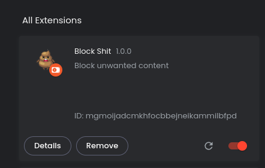

# Block Shit

It is becoming increasingly difficult to get ad blockers to remove promoted content, 
suggested posts and other junk from my news feed.

The junk to content ratio on some sites are about 1000:1 - to see 1 photo of a friend's cat, 
I have to scroll through 1000 other posts containing things I don't want to see.

## Another ad-block?

How is Block Shit different from other ad-blockers?
You can still use ad-blockers, Block Shit will just allow you to filter your feeds using code you 
have written yourself.

## Installation

1. Clone the repo onto your own computer.

2. Go to the extensions page via `brave://extensions/` or `chrome://extensions/`.
3. Enable `developer mode`
4. Click `Load unpacked` to load the cloned repo as a plugin into you browser.
5. Click the reload icon on the extensions page to reload the plugin when you've made changes.

